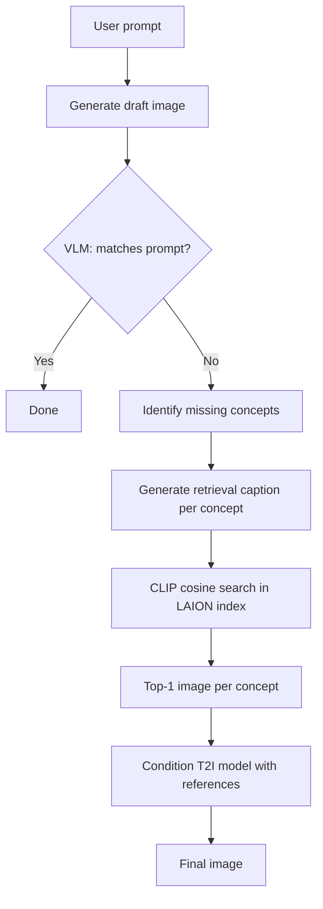
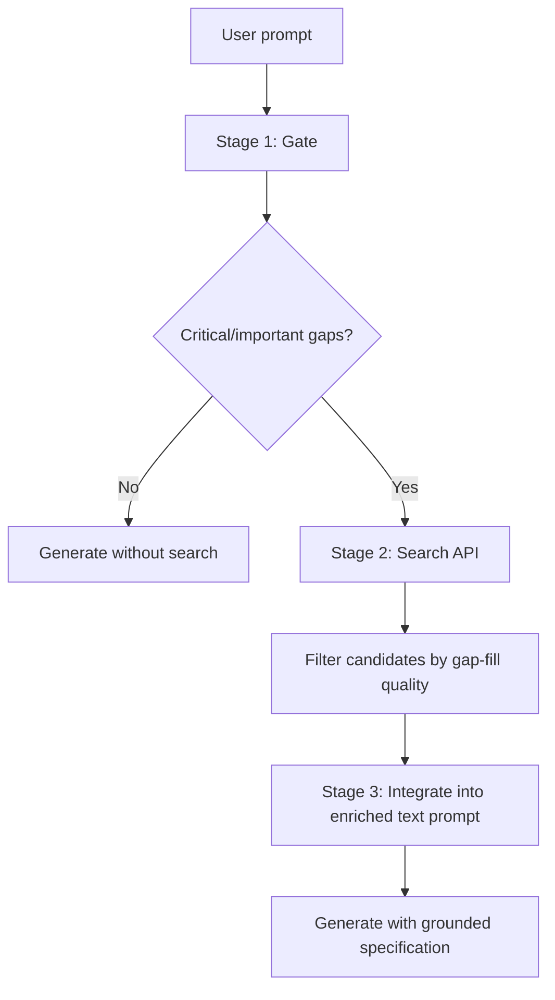

# Image RAG Retrieval — How the Right Images Get Picked

This document summarizes **how retrieval works** across the four papers in `papers/`: what gets queried, what gets searched, how candidates are scored, and what mechanisms ensure the **right** reference images are selected.

---

## Overview: Two Retrieval Paradigms

| Paradigm | Papers | Core idea |
|----------|--------|-----------|
| **Static embedding retrieval** | ImageRAG, ImageRAGTurbo | Pre-index a corpus → embed query → nearest-neighbor lookup |
| **Agentic / reasoned retrieval** | Gen-Searcher, SearchGen | VLM decides *what* to search, *when*, and *which result* to keep |

The hardest part is never "run CLIP" — it is **query formulation** and **selection/filtering**. All four papers invest heavily in that.

```
User prompt
    │
    ├─► [ImageRAG]        VLM finds gaps → writes retrieval captions → CLIP top-1
    ├─► [ImageRAGTurbo]   CLIP text embed of full prompt → ScaNN → top pair
    ├─► [Gen-Searcher]    Agent multi-hop search + image_search → manual pick from top-k
    └─► [SearchGen]       Gate → search API → Filter → Integrate (no raw pixels alone)
```

---

## 1. ImageRAG — Diagnose First, Then Retrieve

**Paper:** `5918_ImageRAG_Dynamic_Image_Re.pdf`

ImageRAG does **not** retrieve from the full prompt blindly. It retrieves only for concepts the base model failed to generate.

### Step 1: Initial generation

Generate a draft image from the original prompt with the base T2I model (SDXL, FLUX, OmniGen, etc.).

### Step 2: Guided CoT — decide *what* to retrieve

A VLM (GPT-4o in their experiments) runs a 3-call chain:

| Call | Purpose | Output |
|------|---------|--------|
| **Decision** | Does the draft match the prompt? | yes / no |
| **Gap identification** | What content/style is missing? | short concept list (e.g. `oil painting style`, `a sheep`) |
| **Caption generation** | Write a standalone caption per missing concept | detailed retrieval captions |

**Why detailed captions matter:** ablations show retrieving from the raw prompt or bare concept names works, but **VLM-generated detailed captions work best** — generic concept strings are too vague for fine-grained retrieval.

Example caption prompt logic:
- Concepts must be short and generic
- Captions must be **standalone** image descriptions usable for automatic lookup, with no knowledge of the draft image

### Step 3: Embedding retrieval

For each retrieval caption:

1. Pre-computed **CLIP ViT-B/32** image embeddings for all corpus images (350K LAION subset)
2. Embed the caption with the same CLIP text encoder
3. **Cosine similarity** → retrieve the most similar image(s)
4. One image per missing concept (up to n=3 for OmniGen; n=1 for SDXL/FLUX due to adapter limits)

**No explicit similarity threshold** in their main setup, but all retrieved images had similarity **> 0.26**.

### Step 4: Optional quality gate

- Apply a **similarity threshold** — discard weak matches
- Optionally **re-run the loop** until the VLM says the output aligns with the prompt

### Step 5: Inject references into generation

Augmented prompt template:

```
According to these examples of <c1>:<img1>, ..., <cn>:<imgn>, generate <p>
```

References are passed via model-specific conditioning (IP-Adapter, OminiControl, OmniGen multi-image input).

### Retrieval strategies tested (Table 4)

| Method | How it works | Verdict |
|--------|--------------|---------|
| **CLIP cosine** | Text embed vs pre-computed image embeds | **Default** — simple, strong |
| **SigLIP** | Same workflow, different encoder | Comparable to CLIP |
| **BM25 re-rank** | Top-3 CLIP/SigLIP candidates → re-rank by caption keyword overlap | Marginal gain |
| **GPT re-rank** | Top-3 candidates → GPT picks best | Slightly better, not worth cost |

**Key insight:** retrieval is easier than generation — SDXL may fail to *generate* a concept but CLIP can still *find* it in the corpus.

### What makes retrieval fail

- **Wrong corpus domain** — e.g. bird dataset cannot help dog breeds; unrelated images are mostly ignored by the generator
- **Ambiguous prompts** — VLM thinks draft is correct (e.g. "love in the mist" → couple vs flower)
- **CLIP limitations** — poor at counting, fine-grained distinctions
- **VLM failure** — falls back to retrieving directly from the full prompt

---

## 2. ImageRAGTurbo — Retrieve at Train + Inference via CLIP Text Space

**Paper:** `Qiu_ImageRAGTurbo_Towards_One-step_Text-to-Image_Generation_with_Retrieval-Augmented_Diffusion_Models_CVPR_2026_paper.pdf`

ImageRAGTurbo retrieves **text–image pairs** from a fixed database and injects them into the diffusion model's H-space. Retrieval is simpler than ImageRAG — no VLM gap analysis — but the model is **finetuned** to use retrieved content.

### Retrieval mechanism

```
Target prompt ptgt
    → CLIP text encoder τϕ (OpenCLIP-ViT-H-14, same as Stable Diffusion)
    → ScaNN approximate nearest neighbor search in text embedding space
    → Top retrieved pair (pretr, xretr)
    → Encode to H-space features → inject via H-space adapter
```

| Component | Detail |
|-----------|--------|
| **Database** | 630K text–image pairs from **OpenImages** |
| **Query** | Full target prompt (not decomposed) |
| **Search** | **ScaNN** in CLIP text feature space |
| **Encoder reuse** | Same CLIP text encoder as the diffusion model — no extra encoder at inference |
| **Alternative** | BM25 lexical retriever mentioned for other applications |
| **Caching** | Retrieval branch features **pre-cached** for training efficiency |

### How "right" images are chosen

- **Semantic proximity in CLIP text space** — retrieved prompt embedding should be close to target prompt embedding
- **Adapter blending weight** tied to cosine similarity between retrieved and target CLIP text embeddings — closer matches get stronger injection
- No learned reflective retriever (unlike RealRAG) — pure embedding NN

### Compared to prior retrieval-augmented diffusion

| Method | Retrieval selection |
|--------|---------------------|
| **RDM / KNN-Diffusion** | k-NN on CLIP image embeddings |
| **Re-Imagen** | Conditions denoiser on retrieved text–image pairs |
| **RealRAG** | Trained **reflective retriever** — picks images that complement missing knowledge |
| **ImageRAGTurbo** | ScaNN on CLIP **text** space + H-space adapter (no separate retriever training) |

---

## 3. Gen-Searcher — Multi-Hop Agentic Search + Image Pick

**Paper:** `2603.28767v3.pdf`

Gen-Searcher treats retrieval as an **agent task**: the model decides what to search, browses results, and explicitly selects reference images before generation.

### Search tools

| Tool | Input | Returns | Used for |
|------|-------|---------|----------|
| **`search`** | Text queries | Top-k webpage URLs + snippets | Facts: names, dates, locations, events |
| **`image_search`** | Text query | Top-k images + URLs + descriptions | Visual identity: faces, outfits, landmarks, objects |
| **`browse`** | Webpage URL | Page content summary (via Qwen3-VL) | Deep extraction when snippets are insufficient |

### Retrieval workflow (inference)

```
1. Receive user prompt
2. Think → plan multi-hop search strategy
3. search() for textual facts (may iterate, cross-check sources)
4. image_search() per visual entity needed
5. Agent inspects returned images (IMG_001, IMG_002, ...)
6. Agent explicitly picks best references (e.g. "I'll pick IMG_002 for iconic view")
7. browse() if webpage evidence needs deeper reading
8. Output: grounded gen_prompt + selected reference_images[]
9. Pass to image generator
```

**Image selection is LLM-judged**, not pure cosine similarity — the agent reads descriptions/thumbnails and picks the image that best grounds the required visual features.

### Training teaches retrieval behavior

- **SFT (10k):** learn multi-turn tool use, query writing, reference selection, grounded prompt composition
- **RL (6k):** GRPO with dual rewards — text reward (does grounded prompt contain enough info?) + image reward (does output match?) — stabilizes search trajectory learning

### What makes the "right" image get picked

- Multi-hop reasoning cross-checks facts before committing to a reference
- Separate **text search** vs **image search** — modality matched to gap type
- Explicit **reference selection** step after seeing candidates
- RL reward ensures selected references actually improve generation

---

## 4. SearchGen — Gate → Filter → Integrate

**Paper:** `2607.05382v4.pdf`

SearchGen's core insight: **naive search hurts** — searching on every prompt degrades outputs the generator already handles. Retrieval must be **selective and filtered**.

### Stage 1: Gate — *should* we retrieve?

Given prompt p, the reasoner:

1. Identifies **knowledge gaps** (entity identity, temporal facts, cultural specifics, etc.)
2. Labels each gap: type + **severity** (critical / important / moderate / minimal)
3. Assigns **modality** per gap: `image` or `web`
4. Proposes search queries

**Only critical or important gaps trigger search.** Max 3 queries, or `SKIP` if nothing actionable.

Example — **search fires:**
> "Shanghai Tower full exterior dusk photograph" — critical visual-identity gap (spiral facade geometry)

Example — **search skips:**
> Generic blue-and-white porcelain teapot studio shot — no named entities, generator handles it parametrically

### Stage 2: Filter — *which* result is right?

After Google Image Search / Web Search returns multiple candidates, the reasoner **selects one** that:

- **Fills the specific gap** identified in Stage 1
- **Minimizes extraneous content** (background, style, layout noise)

Example — UV index dashboard request, 3 candidates:
| Index | Candidate | Selected? |
|-------|-----------|-----------|
| 0 | Generic Home Assistant UV widget | No — not location-specific |
| 1 | Atlanta, GA real-time UV dashboard | **Yes** — matches city + layout |
| 2 | Dermatology clinic UV page | No — wrong context |

This directly prevents **copy effect** — where a reference becomes a template rather than a knowledge supplement.

### Stage 3: Integrate — *how* to use the reference

Even a good image carries too much pixel-level information. SearchGen **does not pass raw pixels alone**:

- Reasoner writes an **enriched text prompt** citing exactly what to borrow
- Example: *"following Image 1, render the acacia tree's forked branching silhouette"*
- Preserves missing knowledge, discards unwanted style/background leakage

### Search policies compared

| Policy | Behavior | Result |
|--------|----------|--------|
| **No search** | Generator only | Baseline |
| **BlindSearch** | Search every nominated gap | **Hurts** NoSearch prompts (−14.6% on some models) |
| **ReasonedSearch** | Gate + filter + integrate | Gains on knowledge-intensive prompts, preserves NoSearch quality |

### Offline retrieval corpus

**SEARCHGEN-CORPUS-1M** — 159K pre-executed search sessions, 705K cached downloads. Retrieval results are **frozen and replayable** for training without live API drift.

---

## Side-by-Side: How the Right Image Gets Picked

| Paper | Query source | Retriever | Selection mechanism | # references |
|-------|-------------|-----------|---------------------|--------------|
| **ImageRAG** | VLM captions for *missing concepts only* | CLIP cosine vs LAION index | Top-1 per caption; optional threshold | 1–3 |
| **ImageRAGTurbo** | Full target prompt | ScaNN on CLIP text embeds (OpenImages) | Nearest neighbor in text space | 1 pair |
| **Gen-Searcher** | Agent-written search queries | Web image search API | Agent inspects top-k, picks best | Multiple, agent-chosen |
| **SearchGen** | Gap-specific queries (modality-labeled) | Google Image + Web Search | VLM filter: gap-fill + min noise | 1 per gap (max 3 gaps) |

---

## Common Principles for Picking the Right Image

### 1. Don't retrieve from the raw prompt (usually)

ImageRAG ablations: retrieving from the full prompt or bare concept names < retrieving from **detailed VLM captions**. SearchGen and Gen-Searcher go further — decompose the prompt into **specific knowledge gaps** first.

### 2. Retrieval is easier than generation

All papers note that CLIP can find concepts diffusion models fail to synthesize. The retriever doesn't need to be smarter than the generator — it needs a **better query** and a **relevant corpus**.

### 3. Corpus domain matters more than corpus size

ImageRAG: specialized datasets (Dogs, Flowers, Cars) beat generic LAION for fine-grained tasks. Larger LAION subsets help, but **relevance dominates scale**.

### 4. Pre-compute embeddings

ImageRAG and ImageRAGTurbo both pre-index the corpus once. At inference, lookup is sub-second.

### 5. Filter noise before injection

| Failure mode | Cause | Fix (from papers) |
|--------------|-------|-------------------|
| **Concept corruption** | Retrieved when generator already knew the answer | Gate / skip search (SearchGen) |
| **Copy effect** | Reference carries too much pixel/style info | Filter + integrate via text (SearchGen) |
| **Irrelevant reference** | Wrong corpus or weak similarity | Domain-specific index, similarity threshold (ImageRAG) |
| **Wrong modality** | Text search for visual identity gap | Separate image vs web search (Gen-Searcher, SearchGen) |

### 6. Similarity metric: CLIP is the default

SigLIP, BM25 re-rank, and GPT re-rank were tested — CLIP cosine similarity is the practical default. GPT re-rank helps slightly but adds cost.

---

## End-to-End Retrieval Pipelines (Visual)

### ImageRAG (inference-only, VLM-guided)



### SearchGen (gate-filter-integrate)



---

## Practical Recipe: Building Retrieval for Your Own System

```
1. INDEX
   • Pick corpus (LAION subset, OpenImages, domain-specific)
   • Pre-compute CLIP/SigLIP image embeddings
   • Store (embedding, image_path, caption) tuples

2. QUERY FORMULATION (most important step)
   Option A — Simple: embed full prompt (ImageRAGTurbo style)
   Option B — Better: VLM identifies gaps → writes captions (ImageRAG style)
   Option C — Best: agent decomposes gaps + modality + severity (SearchGen style)

3. RETRIEVE
   • Cosine similarity or ScaNN for speed at scale
   • Top-k candidates (k=3 if re-ranking, k=1 if simple)

4. SELECT / FILTER
   • Threshold on similarity score (e.g. > 0.26)
   • VLM picks best candidate from top-k (Gen-Searcher, SearchGen Stage 2)
   • Skip retrieval entirely if generator likely knows the answer (SearchGen Stage 1)

5. INJECT
   • Pixel conditioning (IP-Adapter, OminiControl) — ImageRAG
   • H-space adapter blending — ImageRAGTurbo
   • Enriched text prompt with grounded citations — SearchGen, Gen-Searcher

6. VALIDATE (optional loop)
   • VLM checks output vs prompt
   • Re-retrieve if still misaligned
```

---

## Key Takeaway

**Picking the right image is a query + selection problem, not just a vector search problem.**

- **ImageRAG** solves it by asking a VLM *what the model got wrong* before searching
- **ImageRAGTurbo** solves it by finetuning the generator to use CLIP-nearest neighbors
- **Gen-Searcher** solves it by training an agent to search, inspect, and explicitly choose references
- **SearchGen** solves it by gating when to search, filtering candidates by gap relevance, and integrating through text to avoid copy artifacts

The trend across all four: **retrieve less, retrieve smarter, and control how references enter the generator.**
